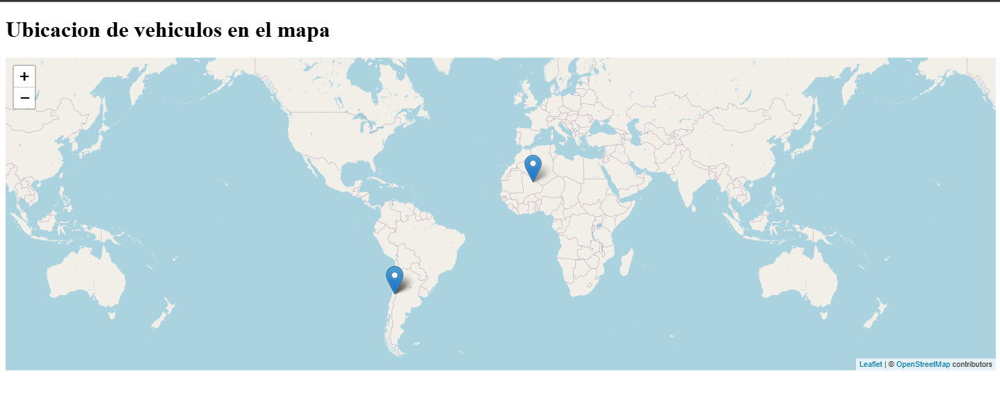

## Prueba técnica, "vehicle_map_test". 
 - ruby 3.2.2
 - rails 7.0.8.6
 - sqlite3
  
## Descripción: 
- En la V1.0 de la API, esta recibe coordenadas de vehículos en cierta estructura definida en formato JSON, almacena los datos y muestra la última ubicación de cada vehículo en un mapa. 

* Al acceder a "localhost:3000/show" despliega la pagina como se muestra en la siguiente captura:     
 
 

- Las cordenadas son enviadas a través de herramientas como postman con la siguiente estructura:

 ## POST URL: http://localhost:3000/api/v1/gps
 
 ## Headers 
 - key = 'Content-Type'
 - Value = 'application/json'
   
 ## Body (raw,json) 
 ```json  
 {
  "latitude": 20.23,
  "longitude": -0.56,
  "sent_at": "2016-06-02 20:45:00",
  "vehicle_identifier": "HA-3452"
}


